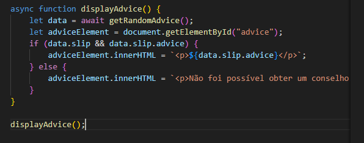

# POC - Fetch API com Adviceslip
# Wagner Araujo Marcelino Junior RA: 10440125
 

  

<h1 align="center">POC - Fetch API</h1>

  O objetivo desta prova de conceito é demonstrar como utilizar a função assíncrona fetch em JavaScript para realizar requisições a uma API e exibir os dados obtidos.

<!-- TABLE OF CONTENTS -->

  
Conteúdo

  <ol>
    <li>
      <a href="#sobre-o-projeto">Sobre o Projeto</a>
    </li>
    <li><a href="#construído-com">Construído com</a></li>
    <li><a href="#pré-requisitos">Pré-requisitos</a></li>
    <li><a href="#uso">Uso</a></li>
    <li><a href="#roadmap">Roadmap</a></li>
    <li><a href="#contato">Contato</a></li>
  </ol>

<!-- ABOUT THE PROJECT -->
## Sobre o Projeto

Esta POC utiliza a **API Adviceslip** para obter e exibir conselhos aleatórios. O projeto visa demonstrar a capacidade de realizar requisições HTTP utilizando o método `fetch` em JavaScript e tratar respostas assíncronas.

(<a href="#readme-top">voltar ao topo</a>)

### Construído com

## HTML5, CSS3 e JavaScript

(<a href="#readme-top">voltar ao topo</a>)

<!-- PREREQUISITES -->
## Pré-requisitos

Antes de executar a POC, certifique-se de ter um navegador moderno instalado. Esta POC faz uso de `fetch`, que é compatível com os navegadores mais recentes.

(<a href="#readme-top">voltar ao topo</a>)

<!-- USAGE -->
## Uso

### 1. Função `getRandomAdvice`
A função `getRandomAdvice` faz a requisição à API e retorna os dados obtidos. Ela utiliza `fetch` para consumir a API de conselhos aleatórios e trata o retorno em formato JSON.

Explicação do método assíncrono:
async: A palavra-chave async define que a função é assíncrona, o que significa que ela pode realizar operações que demoram para completar (como chamadas a APIs) sem bloquear o restante do código.

await: Dentro de uma função async, a palavra-chave await é usada antes de uma operação assíncrona, como o fetch. Isso faz com que o código espere pela conclusão da operação antes de continuar.

### 2. Exibindo o conselho na página

A função `displayAdvice` é responsável por chamar getRandomAdvice e exibir o conselho na página HTML, dentro de um elemento 
 com o ID advice. 

